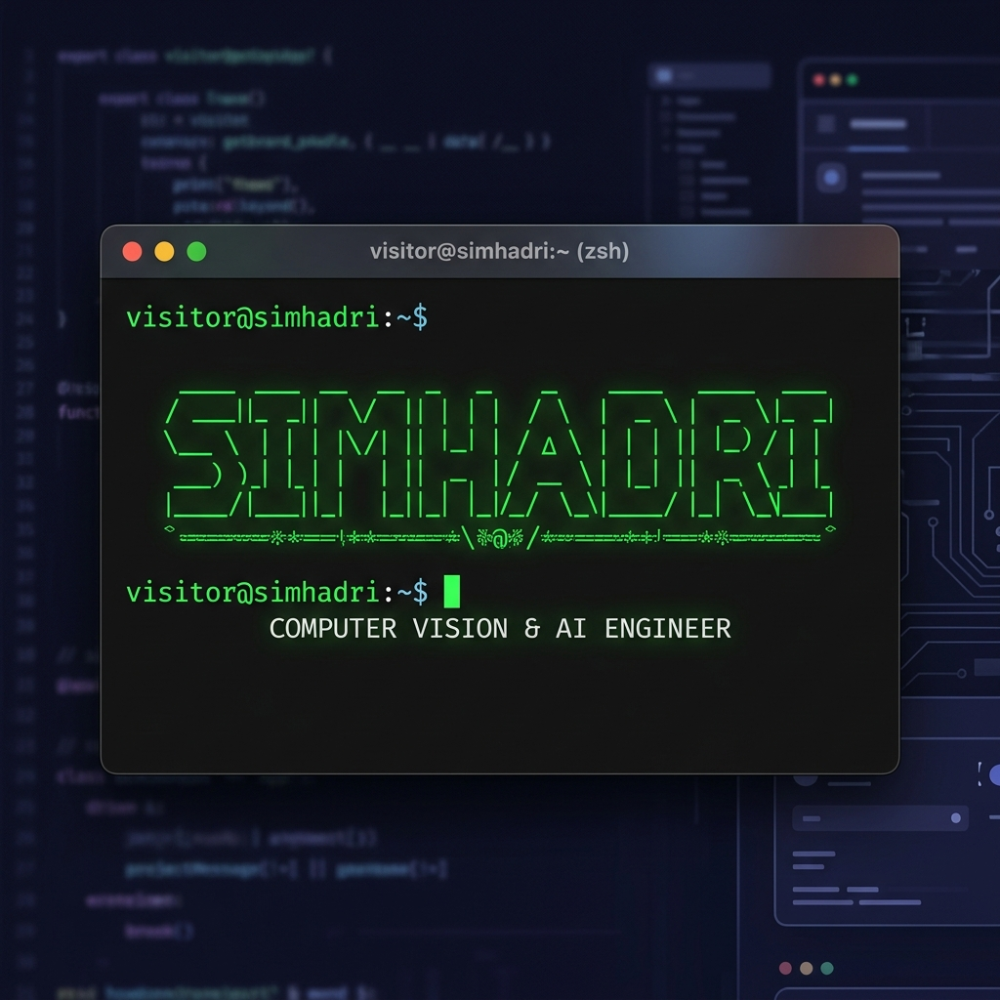

# 🐚 Simhadri Holagundhi | Terminal Portfolio



> **Computer Vision & AI Engineer** building intelligent systems from research to production.

[](https://s1mhadri.github.io)
[](https://github.com/s1mhadri/s1mhadri.github.io)
[](https://opensource.org/licenses/MIT)

A sleek, retro-modern terminal-themed portfolio built with **vanilla HTML, CSS, and JavaScript**. No frameworks, no heavy dependencies, just raw performance and a unique developer-centric aesthetic.

---

## 🚀 Features

- **Interactive Terminal Emulator**: A fully functional CLI on the landing page.
- **Custom Commands**: Navigate the site using `/projects`, `/experience`, `/skills`, etc.
- **Responsive Terminal UI**: Designed to look great on desktop and mobile.
- **ASCII Art & Progress Bars**: Retro-style visualizations for skills and progress.
- **Timeline-based Navigation**: Clean, vertical/horizontal timelines for education and work history.
- **Man-page Styled CV**: A professional CV presented in a clean, terminal documentation format.
- **Micro-animations**: Subtle hover effects and terminal typing animations for a premium feel.

## 🛠️ Built With

- **HTML5**: Semantic structure for better SEO and accessibility.
- **Vanilla CSS**: Custom design system with CSS variables, glassmorphism, and responsive layouts.
- **Vanilla JavaScript**: Custom terminal logic, command parsing, and DOM manipulation.
- **No Dependencies**: 0 npm packages, 0 frameworks. Ultra-fast load times.

## 📁 Repository Structure

```text
.
├── assets/
│   ├── css/          # Base styles and page-specific styles
│   ├── js/           # Terminal logic and main application scripts
│   └── docs/         # PDF Resume and other documents
├── index.html        # Landing page (Terminal Emulator)
├── experience.html   # Professional history timeline
├── projects.html     # Featured work and research
├── skills.html       # Technical stack and toolset
├── education.html    # Academic background
├── cv.html           # Terminal-themed printable CV
└── contact.html      # Connection links and form
```

## ⌨️ Available Commands

On the landing page, you can interact with the terminal:

- `/help` - Show all available commands
- `/experience` - Navigate to professional experience
- `/projects` - View my work
- `/skills` - Check out my tech stack
- `/education` - View my academic history
- `/cv` - Open my full CV
- `/contact` - Get in touch
- `/clear` - Clear the terminal screen

## 🛠️ Installation & Local Development

1. **Clone the repository:**
   ```bash
   git clone https://github.com/s1mhadri/s1mhadri.github.io.git
   cd s1mhadri.github.io
   ```

2. **Run locally:**
   Since this is a static site, you can just open `index.html` in your browser, or use a simple local server:
   ```bash
   # If you have Python installed
   python3 -m http.server 8000
   ```

3. **View the site:**
   Open `http://localhost:8000` in your browser.

## 📄 License

This project is [MIT](LICENSE) licensed.

---

<p align="center">
  Built with ⌨️ by <a href="https://github.com/s1mhadri">Simhadri Holagundhi</a>
</p>
